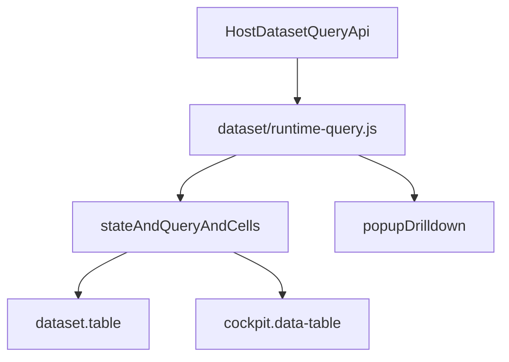

# table-runtime 共享层

`table-runtime/` 是表格共享内核，不承担 renderer 外观本身。

当前文件：

| 文件 | 职责 |
|------|------|
| `state.js` | 合并 `query_state` 与本地 table state（`filters` / `sort` / `column_state`） |
| `query.js` | 把 `/api/datasets/query` 响应归一化到表格状态 |
| `cells.js` | 单元格截断、全文弹层、预览交互 |
| `format.js` | 共享列描述、数字/时间/文本格式化、tone 规则 |
| `footer.js` | 底部分页区「共 N 条」总计文案 |

## 在整体架构中的位置

说明：

- `runtime-query.js` 是 **host bridge**
- `table-runtime/` 是 **renderer 无关状态机/工具层**
- `dataset.table` 与 `cockpit.data-table` 是 **两种 renderer 壳**
- popup / drilldown 当前只部分复用 `table-runtime`，仍主要是宿主桥接路径

## `state.js`

当前承接：

- `sameFilters()`
- `sharedFiltersForProps()`
- `activeTableFilters()`
- `normalizeSort()`
- `resolveSortConfig()`
- `sharedSortForProps()`
- `activeTableSort()`
- `normalizeColumnState()`
- `resolveColumnStateConfig()`
- `activeTableColumnState()`

边界：

- 只负责“如何得到当前 query 条件”
- 不负责 DOM、分页器、toolbar、轮播

当前现实：

- `query_state.filters` 已正式驱动 renderer 刷新
- `query_state.sort` 已可进入请求链路
- `query_state.column_state` 已可被 runtime 识别并回显
- 但 renderer 尚未把这些字段统一回写成共享页面真值

## `query.js`

当前承接：

- `applyTableQueryResult()`
- `headersFromColumnMeta()`

归一化字段包括：

- `rows`
- `total`
- `hasMore`
- `column_meta`
- `summary`
- `query_state_echo`
- `perf`

边界：

- 负责把 host contract V1 响应写成 renderer 可消费 state
- 不决定 renderer 如何展示这些字段

当前现实：

- `dataset.table` 与 `cockpit.data-table` 已都使用 `applyTableQueryResult()`
- 但两个 renderer 对 `column_meta` / `summary` / `query_state_echo` 的渲染与消费仍不对称

## `cells.js`

当前承接：

- `cellValue()`
- `resolveCellPreviewMaxChars()` / `resolveTruncateMaxChars()`
- `renderFormattedCellHtml()`（截断后 **…** 为可点击触发器；打开居中大字弹窗，不用悬停全文）
- `formatCellInnerHtml()`
- `cellPopoverStyleBlock()` / `resolveCellPopoverVariant()`（`default` | `large` 大屏字号）
- `bindCellPreviewClick()` / `openCellPopover()` / `closeCellPopover()`

边界：

- 负责文本截断、悬停 tooltip（`title`）与可点开详情弹层
- 不负责 tone/tag 皮肤，也不负责具体 `<td>` / grid cell DOM

当前现实：

- `dataset.table` 与 `cockpit.data-table` 均走 `renderFormattedCellHtml()` 与统一弹层样式
- cockpit 仍保留 tag/tone 包装等 renderer 私有壳

## `format.js`

当前承接：

- `resolveColumnDescriptors()`
- `formatCellDisplay()` / `formatCellDetail()` / `formatCellPresentation()` / `formatRelativeTimeForRaw()`
- `bindRelativeTimeTicker()` / `refreshRelativeTimeCells()`（相对时间定时刷新 + 悬停绝对时间）
- `formatPercentValue()`（`type: percent`，`precision`，`percentInput: ratio|value`）
- `resolveToneToken()`
- `DEFAULT_CELL_PADDING`（经 `inlineStyleForColumn` 写入 th/td 或 grid cell）
- `buildColumnTemplate()` / `columnLayoutWeights()`：全表共用一套 **fr 比例轨**（表头与各行对齐）；`width_mode: "fixed"` 锁死短列；长文本靠 `truncate` + …，不靠逐行 `max-content`
- `width_mode`：`min`（下限）、`content`（随内容）、`fixed`（锁宽）、`max`（上限）
- `isLongTextColumnKey()`（中英列名启发式，未写 `truncate` 时长文本列仍单行截断 + 点击 …）
- `cellExpandLabel` / `cell_expand_label`：仅作 … 按钮的 **aria-label**，不占单元格宽度

**截断优先级**（`cells.resolveTruncateMaxChars`，与列宽像素无关）：`truncate:false` → **`maxChars`** → `truncate:true` → 列名启发式 → 不截断。列宽只影响未配置字符截断时的物理裁剪；数字/时间等短列靠 **固定宽 / 较小 fr 权重**，不靠逐行撑开。

边界：

- 负责共享列状态解释、数字/时间/文本格式化、通用 tone rule
- 不负责 toolbar、分页、`layoutPreset`、carousel

当前现实：

- `dataset.table` 与 `cockpit.data-table` 已都消费同一份共享格式化规则
- renderer 仍可保留自己的 tag/tone 外观包装与默认皮肤

## 什么应继续进入共享层

- query payload 构造
- filters / sort / `column_state` 合并
- query 响应归一化
- 共享列描述与格式化
- 单元格全文弹层
- runtime diagnostics / perf 透传

## 什么不应进入共享层

- manage toolbar
- server paging 启发式判定
- cockpit `layoutPreset`
- `embedded`
- `carousel`
- warning tone/tag 皮肤
- popup overlay 生命周期

## 当前不完整之处

1. popup / drilldown 虽已优先复用 `runtime-query.js`，但仍未完全纳入 `table-runtime` 状态机。
2. renderer 对 `query_state_echo` 的回写与页面级共享真值仍不一致。
3. `query_state` 里的 `sort` / `column_state` 仍处于“请求链路可用、页面级真值未冻结”的阶段。

## 设计原则

在达到下面条件前，不建议把两个 renderer 合并成单组件：

1. `dataset.table`、`cockpit.data-table`、popup 至少三处稳定走同一套状态机；
2. renderer 差异收敛为 render hook，而不是两套分页/刷新模型；
3. host contract 的字段已被稳定消费，而不只是接线。

也就是说，当前执行原则仍然是：

> 先收敛 host contract 与 table runtime，再评估 renderer 是否继续下沉到同一基类或单 tag。
